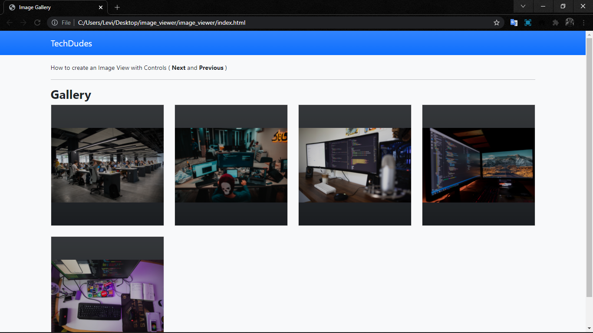
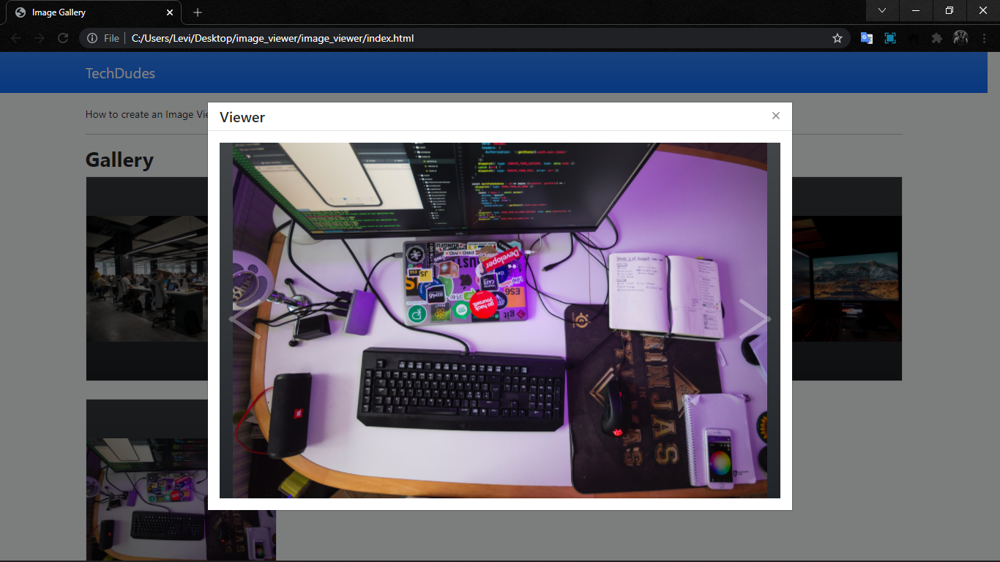

# Simple-Image-Gallery-with-Viewer-Modal-using-jQuery-and-Bootstrap

A Simple a Image Gallery web application with an image viewer modal.The Image Viewer will also have control button for navigating to the pervious or next image. We will be using Bootstrap for the design of the application and jQuery to dispaly image on the viewer modal and for navigation control functionalities.

 
